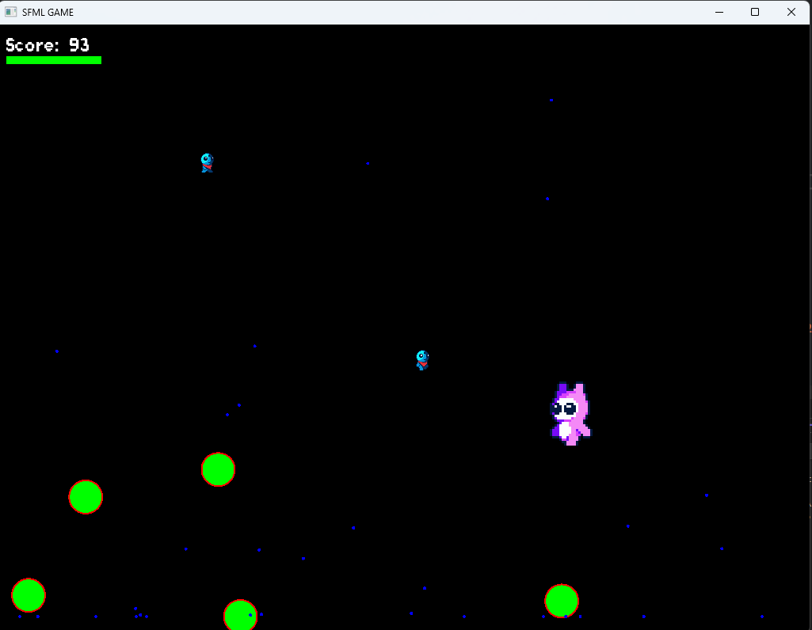

# 🎮 SFML Learning Game


A simple **2D game built in C++ with SFML** as my first step into game development.  
This project was made to **learn OOP, game loops, animations, collisions, and resource management** in C++.  

---

## 📸 Preview



---

## 🚀 Features

- ✅ **Game Loop** (update → draw → input handling)  
- ✅ **Abstract Base Class** `GameObject` for all entities  
- ✅ **Player** with movement controls  
- ✅ **Enemies**  
  - Multiple enemy types (`FastEnemy`, `SlowEnemy`)  
  - AI: enemies chase the player  
- ✅ **Animations** using sprite sheets  
- ✅ **Health & Damage system**  
- ✅ **Power-ups** (abstract base, ready for extensions)  
- ✅ **Collision bounds & radius checks**  
- ✅ **Fallback texture** (magenta square if texture not found)  

---

## 🧑‍💻 What I Learned

Through this project I practiced both **C++** and **game development concepts**:

- 🎯 SFML basics (rendering, input, textures, sprites)  
- 🎯 Object-Oriented Programming (inheritance, polymorphism, abstract classes)  
- 🎯 Smart pointers (`std::unique_ptr`) and managing game objects in `std::vector`  
- 🎯 Animation handling with frame updates using delta time  
- 🎯 Game math (vector normalization, movement direction, collision detection)  
- 🎯 Debugging and error handling in real-world C++ projects  

---

## 🕹️ How to Play

1. Clone the repository:
   ```bash
   git clone https://github.com/yourusername/sfml-learning-game.git
